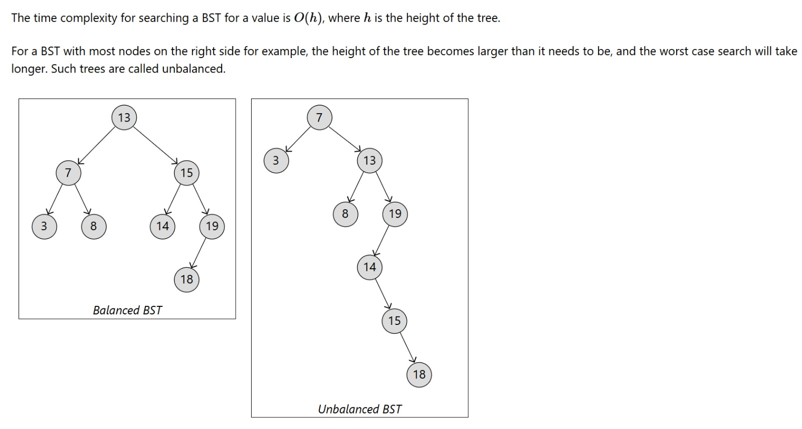
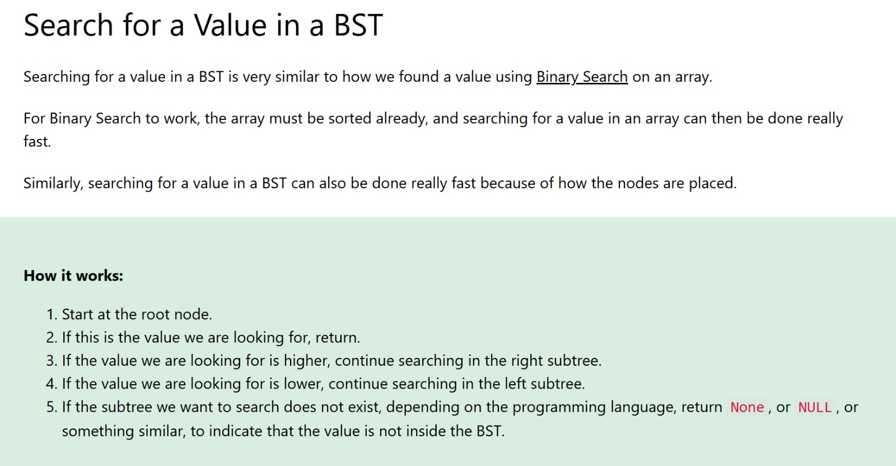

---

# Binary Search Tree (BST) Search in Python

This project demonstrates how to **search for a value in a Binary Search Tree (BST)** using recursion. It also includes an **in-order traversal** to show how BST nodes are stored in sorted order.

Searching in a BST is conceptually similar to **binary search on a sorted array**, which allows efficient lookups by eliminating half of the remaining nodes at each step.

---

## 📌 What Is a Binary Search Tree?

A **Binary Search Tree (BST)** is a binary tree where:

* The **left subtree** of a node contains values **less than** the node’s value
* The **right subtree** contains values **greater than** the node’s value
* Both left and right subtrees are also BSTs

Because of this structure, searching is efficient.

---

## 🔍 How Searching Works in a BST

1. Start at the **root node**
2. If the current node’s value equals the target, return it
3. If the target value is **less**, search the **left subtree**
4. If the target value is **greater**, search the **right subtree**
5. If a subtree does not exist, the value is **not in the tree**

---

## ⏱ Time Complexity

* **Best / Average case:** `O(log n)` (balanced tree)
* **Worst case:** `O(h)` where `h` is the height of the tree (unbalanced tree)

---

## ⚖ Balanced vs Unbalanced BSTs

### Balanced BST

A balanced tree keeps its height small, resulting in faster searches.

### Unbalanced BST

An unbalanced tree behaves 
more like a linked list, making searches slower.

---



## 🧠 BST Search Visualization

The diagram below shows how searching moves left or right depending on the value being compared.



---

## 🧩 Code Overview

### TreeNode Class

Defines a node in the BST.

```python
class TreeNode:
    def __init__(self, data):
        self.data = data
        self.left = None
        self.right = None
```

---

### In-Order Traversal

Prints the BST values in **sorted order**.

```python
def inOrderTraversal(node):
    if node is None:
        return
    inOrderTraversal(node.left)
    print(node.data, end=", ")
    inOrderTraversal(node.right)
```

---

### Tree Construction

```python
root = TreeNode(13)
node7 = TreeNode(7)
node15 = TreeNode(15)
node3 = TreeNode(3)
node8 = TreeNode(8)
node14 = TreeNode(14)
node19 = TreeNode(19)
node18 = TreeNode(18)

root.left = node7
root.right = node15

node7.left = node3
node7.right = node8

node15.left = node14
node15.right = node19

node19.left = node18
```

This creates the following BST structure:

```
        13
       /  \
      7    15
     / \   / \
    3   8 14 19
              /
             18
```

---

### Search Function

```python
def search(node, target):
    if node is None:
        return None
    elif node.data == target:
        return node
    elif target < node.data:
        return search(node.left, target)
    elif target > node.data:
        return search(node.right, target)
```

---

### Example Search

```python
result = search(root, 3)
if result:
    print("Target Found in Node:", result.data)
else:
    print("Not Found")
```

**Output:**

```
Target Found in Node: 3
```

---

## ✅ Summary

* BSTs allow **fast searching** by eliminating half of the tree at each step
* Balanced trees perform better than unbalanced trees
* Recursive search is clean and easy to understand
* In-order traversal confirms the BST is correctly structured

---